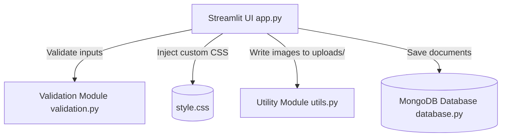

# Project Brief: Student Registration System (Single-Page)

This document provides a formal, objective brief of the Student Registration System, defining its goals, architecture, data flow, and code requirements.

---

## 1. Primary Objectives
The core goals of this project are:
* **Candidate Intake**: To provide a clean, distraction-free, single-page web form for students and professionals to register for courses.
* **Database Persistence**: To automatically save validated details as document records inside a local MongoDB collection.
* **Document Verification**: To accept, preview in real-time, and store identity card files (Aadhaar Front & Back) in local folders.
* **UI Theme Contrast**: To enforce strict element styling rules so all form labels and cards remain visible and legible in both Light and Dark OS/browser modes.
* **Beginner-Level Readability**: To structure Python code linearly without type hints, high-level wrapper frameworks, or complex regular expressions, making the project educational.

---

## 2. Functional Specifications

### A. Input Sections (Cards)
1. **Personal Details**: Captures full name, email, phone number, gender, date of birth, father's name, and father's phone number.
2. **Address Details**:
   - Local Address.
   - Checkbox: "Same as Local Address".
   - Permanent Address (automatically copies the local address and becomes read-only when checked).
3. **Aadhaar Verification**: Side-by-side file upload drop zones supporting `.jpg`, `.jpeg`, and `.png` file uploads. Previews the uploaded images immediately.
4. **Professional Details**:
   - Toggles fields dynamically based on status radio buttons:
     - **Student**: Qualification, passing year, and college name.
     - **Working Professional**: Highest qualification, company name, and years of experience.
5. **Course Selection**: Dropdown containing courses and a horizontal list of referral sources.
6. **Terms**: A mandatory checkbox to agree to Terms & Conditions before registration submission.

### B. Validation Rules
* **Required Fields**: Rejects submissions containing empty values for required fields.
* **Phone numbers**: Validates that both student and father phone numbers are exactly 10 digits (cleaning hyphens or spaces beforehand).
* **Email Address**: Confirms standard presence checks (`@` and `.`).
* **Document uploads**: Blocks submissions if front or back Aadhaar images are missing.

---

## 3. Technical Architecture & Constraints

* **Frontend Framework**: Streamlit (Python-based web server).
* **Database**: MongoDB (running locally at `mongodb://localhost:27017/` on database `student_db` and collection `students`).
* **Styling**: Injectable Vanilla CSS (`style.css`) to enforce card borders (`st.container(border=True)`), pill-shaped segmented capsules, and high-contrast color text rules.
* **File Storage**: Saves files on disk to `uploads/front/` and `uploads/back/` using unique timestamps (`phone_timestamp.ext`) to prevent overwriting.

---

## 4. Code Standards
* **Linear Structure**: Avoid complex decorators, classes, or nested OOP structures.
* **Type-Hint Free**: Keep function signatures simple (no `typing` package imports).
* **Verbose Comments**: Add comments detailing step-by-step logic.
